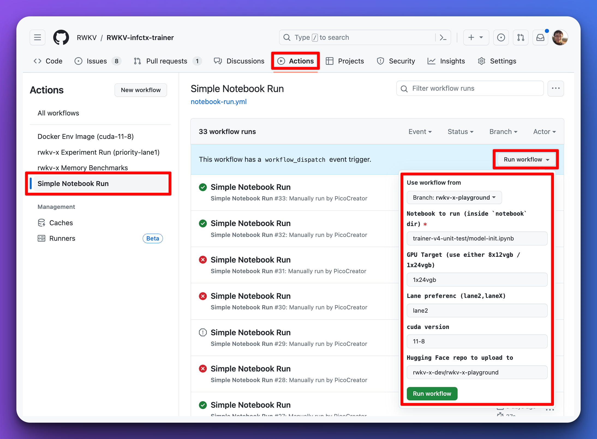

# RWKV-x-playground Training / Experiment runs

Have an idea / experiment you want to test, by changing the RWKV architecture in certain ways? But do not have the GPUs to execute on it?
Let us facilitate those runs here.

# Steps for the process

1) Clone the `rwkv-x-playground` branch : https://github.com/RWKV/RWKV-infctx-trainer/tree/rwkv-x-playground
2) Copy the v5 folder, and give it a new name according to your changes (ie. v5-short-description)
3) Make your changes accordingly
4) Test and iterate your changes with a smaller model locally if possible
    - Important to note: we may not have time to debug issues with your model, if it does not run, we will skip and move on to the next request in queue
5) Prepare your notebook for the training run (typically just enwiki) inside, see the following for an example : https://github.com/RWKV/RWKV-infctx-trainer/tree/rwkv-x-playground/notebook/experiment/rwkv-x-playground/v5-headsize32
    - your must output your finished model into the "model" folder, this is what gets scanned for upload
    - your dataset should be downloadable via huggingface / a link, do not commit your dataset into the repo
    - any required models should also be donwloaded as part of the notebook
    - use the example settings for datapath & checkpoints
6) Perform a pull request to `rwkv-x-playground` with the title `[training request] description`, you must include your RWKV discord handle, and a description of what you are experimenting with, and whats your expected outcome / hypothesis you want test 
    - note that all followup will be done via discord.
    - We may rename, and reorganize your files, and if we do so, we will keep you updated. 
    - Once completed, all training runs results and output will be uploaded to hugging face. Example: https://huggingface.co/rwkv-x-dev/rwkv-x-playground/tree/main/experiment/rwkv-x-exp/v5-headsize32

# Restrictions on the trianing process
- Generally, keep your model size <= 1.5B - as we only have up to 3090s currently (not a hard-rule, but anything bigger typically take days)
- Keep your training runs under 12 hours, we may priotize shorter runs over longer runs (case by case basis)
- We have the right of refusal, and have no obligations. Existing runs may take priority

# Who can approve the training request

@picocreator - Depending on your model size and dataset size will schedule your runs between downtime of training runs.
Generally speaking the (1x24vgb) is usually more readily avaliable then the (8x24vgb) training server

# How to execute a training process (for maintainers / users with direct write access)

> After having all the notebooks setup, validate that its not "running anything evil". Once ready ...

1) Under github, goto the actions tab
2) Do a quick check if there is too much in Q, if so you may want to schedule later (to avoid having your action run timeout in 24 hours)
3) Select "Simple Notebook Run", on the left side "actions" list
4) You should see a dropdown menu for "Run Workflow" appear
5) Fill in the notebook path, and change the desired GPU setting (1x24vgb / 8x24vgb)
6) Once the workflow is scheduled, check it subsequently for any issues, when completed you can find everything uploaded to HF, with the URL provided in the run

# Terms and condition

All RWKV-x-playground community submissions, restrictions
- all code submissions will be licensed back to RWKV under apache2
- all training run and results will be licensed under apache2, and published onto huggingface in public
- we will priotise the runs according the impact to the RWKV community
- experiments are limtied to v5 or newer derivatives. We will not be support v4 experiments.
- the maintianers (ie. picocreator, blinkdl, etc) 
    - have the right to reject your submission
    - have the right to make adjustments, and reschedule your runs accordingly
    - have no obligation to schedule your run immediately (existing experiments typically takes priority)